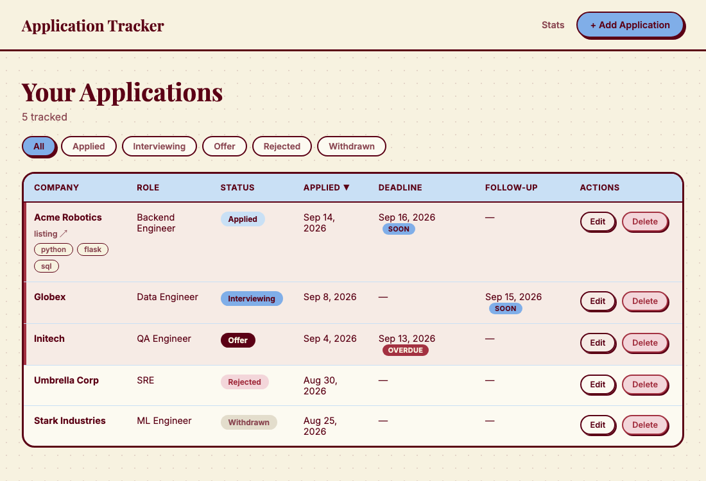
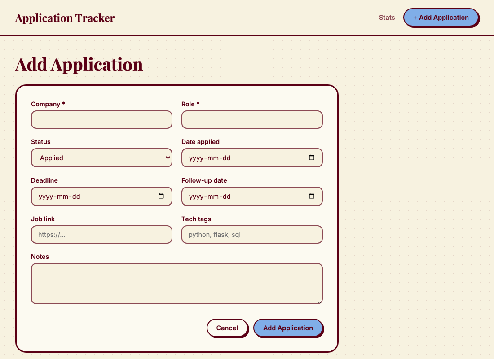
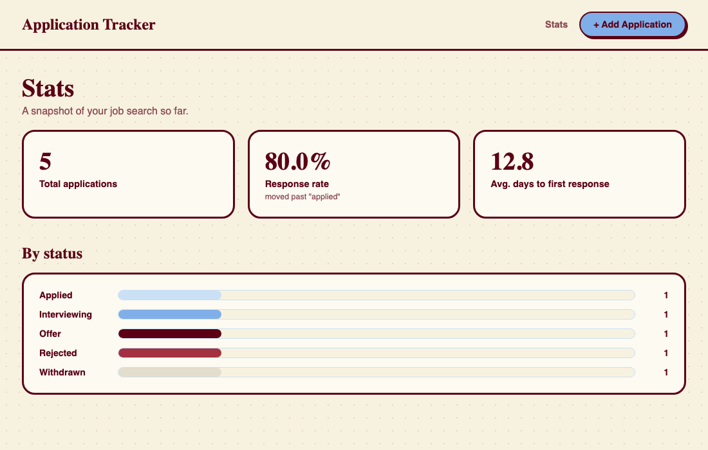

# Application Tracker

A self-hosted job application tracker: log applications, see what needs attention at a glance, get emailed before deadlines and follow-ups slip, and check your response-rate stats over time.



## Features

- **Track applications** — company, role, status, dates applied, deadlines, follow-ups, job link, tech tags, notes.
- **Sortable, filterable table** — sort by any column, filter by status.
- **Urgency highlighting** — rows with a deadline or follow-up due soon (or overdue) are flagged automatically.
- **Email reminders** — a daily digest of what's due soon or overdue, sent via Gmail SMTP.
- **Stats dashboard** — total applications, breakdown by status, response rate, and average time to first response.

| Add application | Stats |
| --- | --- |
|  |  |

## Tech stack

- **Backend:** Python 3, Flask
- **Data:** SQLite via SQLAlchemy
- **Frontend:** Jinja2 templates, hand-written CSS (no JS framework)
- **Reminders:** `smtplib` (Gmail SMTP) + the `schedule` library
- **Tests:** pytest
- **Deploy:** Railway (Gunicorn)

## Project structure

```
app.py              # Flask app factory + entry point
reminders.py         # Daily digest email logic
scheduler.py          # Runs reminders.py on a schedule (local/always-on use)
cli.py                # Command-line CRUD menu (from the early prototype)
src/
  models.py           # SQLAlchemy Application model
  database.py          # Engine/session setup
  crud.py              # Data-access functions (add/list/update/delete)
  stats.py              # Stats aggregation
  routes.py             # Flask route handlers
Frontend/              # Templates (base.html, index.html, form.html, stats.html) + style.css
tests/                 # pytest suite
```

## Local setup

```bash
python3 -m venv venv
source venv/bin/activate
pip install -r requirements.txt
python app.py
```

The app runs on `http://localhost:5000` (or `$PORT` if set) and creates `applications.db` (SQLite) on first run.

## Environment variables

| Variable | Required | Default | Purpose |
| --- | --- | --- | --- |
| `SECRET_KEY` | recommended in production | dev key | Flask session signing |
| `DATABASE_URL` | no | `sqlite:///applications.db` | SQLAlchemy connection string |
| `PORT` | no | `5000` | Port for the dev server |
| `REMINDER_EMAIL_ADDRESS` | for reminders | — | Gmail address to send from |
| `REMINDER_EMAIL_APP_PASSWORD` | for reminders | — | Gmail [app password](https://myaccount.google.com/apppasswords) (not your login password) |
| `REMINDER_TO_EMAIL` | no | same as sender | Where the digest is sent |
| `REMINDER_DAYS_AHEAD` | no | `3` | How many days ahead counts as "soon" |
| `REMINDER_TIME` | no | `08:00` | Daily run time for `scheduler.py` |
| `SMTP_HOST` / `SMTP_PORT` | no | `smtp.gmail.com` / `465` | SMTP server override |

## Running tests

```bash
pytest
```

## Email reminders

Run once, on demand:

```bash
python reminders.py
```

Run daily, in the background (local/always-on use):

```bash
python scheduler.py
```

On Railway, prefer a Cron Job that runs `python reminders.py` directly on a schedule instead of keeping `scheduler.py` alive.

## Deploying to Railway

1. Push this repo to GitHub and create a new Railway project from it (or `railway init` with the Railway CLI).
2. Railway detects the `Procfile` (`web: gunicorn app:app`) and installs `requirements.txt` automatically.
3. Set environment variables in the Railway dashboard: at minimum `SECRET_KEY`; add the `REMINDER_*` variables if you want email reminders.
4. **Persist the database:** Railway's filesystem is ephemeral between deploys. Attach a Railway Volume (e.g. mounted at `/data`) and set `DATABASE_URL=sqlite:////data/applications.db` so your data survives redeploys.
5. For reminders, add a Railway Cron Job (or a second service) that runs `python reminders.py` on a daily schedule with the same environment variables.
